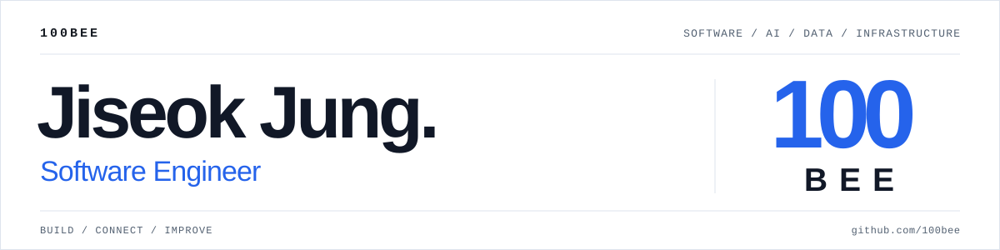

  

**[Portfolio ↗](https://100bee.github.io/)** &nbsp; · &nbsp; [Projects](#selected-projects) &nbsp; · &nbsp; [Contact](#contact)

## About

안녕하세요, **소프트웨어 엔지니어 정지석**입니다. 
문제를 이해하고 필요한 기술을 연결해, 실제로 사용할 수 있는 서비스를 만듭니다.

AI·컴퓨터비전·데이터·인프라에 관심을 두고, 프로젝트의 구현부터 평가와 배포까지 경험을 쌓고 있습니다.

## Tech Stack

**AI & Computer Vision**

**Software Development**

**Data & Retrieval**

**Infrastructure & Delivery**

## Selected Projects

<table>
  <tr>
    <td width="50%" valign="top">
      <h3><a href="https://github.com/100bee/rag-ops-copilot">RAGOps Copilot ↗</a></h3>
      
<b>운영 문서 기반 RAG 장애 대응 도우미</b>

      
Runbook과 장애 기록에서 관련 근거를 검색해 대응 절차를 제안하는 서비스입니다.

      <ul>
        <li>벡터·키워드·하이브리드 검색 비교</li>
        <li>Golden Dataset 기반 검색 품질·지연시간 평가</li>
        <li>출처, 검색 점수, 토큰 사용량과 실행 기록 확인</li>
      </ul>
      
Python · FastAPI · PostgreSQL · pgvector · Next.js

      
<a href="https://github.com/100bee/rag-ops-copilot/blob/main/docs/hybrid-retrieval-experiment.md">검색 비교 실험 ↗</a>

    </td>
    <td width="50%" valign="top">
      <h3><a href="https://github.com/CSInterviewProject/ITPT_PUBLIC">ITPT ↗</a></h3>
      
<b>AI 기반 CS 면접 연습 플랫폼</b>

      
음성 답변부터 STT 변환, AI 평가와 피드백, 학습 기록까지 연결한 면접 연습 서비스입니다.

      <ul>
        <li>Clova STT·OpenAI 연동과 약점 분석 대시보드</li>
        <li>JWT·OAuth 2.0 인증 및 문제 은행 관리</li>
        <li>Docker·AWS EC2 배포와 GitHub Actions 자동화</li>
      </ul>
      
Java · Spring Boot · React · MySQL · Docker

      
<a href="https://itptapp.com/">서비스 방문 ↗</a>

    </td>
  </tr>
  <tr>
    <td width="50%" valign="top">
      <h3><a href="https://github.com/100bee/a-little-writer">a-little-writer ↗</a></h3>
      
<b>일기를 4컷 만화로 만드는 AI 앱</b>

      
일기 텍스트에서 장면을 기획하고, 대사와 이미지 프롬프트를 만든 뒤 4컷 만화를 생성합니다.

      <ul>
        <li>기획 → 프롬프트·대사 → 이미지 생성 워크플로</li>
        <li>그림 스타일, 대사 톤과 이미지 시드 선택</li>
      </ul>
      
Python · Streamlit · Gemini · Pollinations

      
<a href="https://github.com/100bee/a-little-writer#demo">생성 결과 보기 ↗</a>

    </td>
    <td width="50%" valign="top">
      <h3><a href="https://github.com/100bee/chronote">Chronote ↗</a></h3>
      
<b>함께 공부하는 AI 학습 관리 플랫폼</b>

      
관심사 기반 스터디 매칭과 학습 기록을 연결해 꾸준히 공부할 수 있도록 돕는 팀 프로젝트입니다.

      <ul>
        <li>AI 관심사 매칭과 실시간 그룹 채팅</li>
        <li>타이머·투두·랭킹 및 학습 통계 시각화</li>
      </ul>
      
React · Node.js · FastAPI · MySQL · MongoDB

      
<a href="https://100bee.github.io/chronote-demo/">UI 미리보기 ↗</a>

    </td>
  </tr>
</table>

## Education & Activities

| 기간 | 내용 |
| :--- | :--- |
| 2024.03 — 2026.08 | 단국대학교 소프트웨어학과 졸업 |
| 2025.12 — 2026.03 | ITPT — 졸업 프로젝트, AI 면접 서비스 개발 및 배포 |
| 2025.06 — 2025.12 | Chronote — TABA 팀 프로젝트, AI 학습 관리 플랫폼 개발 |

## Contact

[**wjdwltjr3939@naver.com**](mailto:wjdwltjr3939@naver.com) &nbsp; · &nbsp; [**Portfolio ↗**](https://100bee.github.io/)
